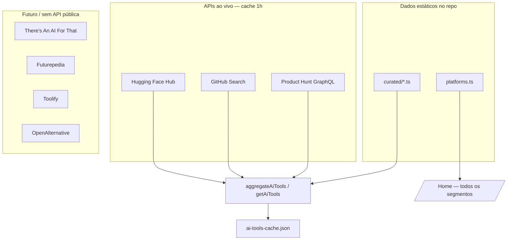

# Fontes de dados — Arquitetura do diretório

Este documento descreve as APIs e fontes usadas (ou planejadas) para montar o catálogo de ferramentas de IA.

## Visão geral

Não existe **uma única API** que liste todas as ferramentas de IA (pagas, freemium e open source). A arquitetura recomendada — e a que este projeto segue — é:



## Status por fonte

| Fonte | API pública | Status no projeto | Auth | Pricing |
|-------|-------------|-------------------|------|---------|
| **Curated (repo)** | N/A | ✅ Implementado | — | `open-source` default |
| **Hugging Face Hub** | ✅ `GET /api/models`, `/api/spaces` | ✅ Implementado | Não | `open-source` |
| **GitHub Search** | ✅ `GET /search/repositories` | ✅ Implementado | Opcional `GITHUB_TOKEN` | `open-source` |
| **Product Hunt** | ✅ GraphQL v2 | ✅ Implementado | `PRODUCTHUNT_TOKEN` | `freemium` (inferido) |
| **There's An AI For That** | ❌ Sem API oficial | 📋 Documentado | Parceiros (ex. Parse) | Sim |
| **Futurepedia** | ⚠️ Limitada / scraping | 📋 Documentado | — | Sim |
| **Toolify** | ⚠️ Sem API documentada | 📋 Documentado | — | Sim |
| **OpenAlternative** | ❌ Sem API pública | 📋 Documentado | — | OSS only |

## 1. Hugging Face Hub API

Excelente para **modelos e Spaces open source**.

```bash
curl "https://huggingface.co/api/models?sort=downloads&direction=-1&limit=10"
curl "https://huggingface.co/api/spaces?sort=likes&direction=-1&limit=10"
```

**Cliente:** `src/lib/huggingface.ts`

## 2. GitHub API

Descobre **repositórios open source** de IA.

```bash
curl -H "Accept: application/vnd.github+json" \
  "https://api.github.com/search/repositories?q=topic:llm+stars:>500&sort=stars"
```

**Cliente:** `src/lib/github.ts`  
**Env:** `GITHUB_TOKEN` (opcional, aumenta rate limit)

## 3. Product Hunt API

Útil para **lançamentos recentes** e produtos comerciais/freemium antes de aparecerem em diretórios.

```graphql
POST https://api.producthunt.com/v2/api/graphql
Authorization: Bearer {PRODUCTHUNT_TOKEN}

query {
  posts(first: 20, order: VOTES) {
    edges { node { name tagline url votesCount website } }
  }
}
```

**Cliente:** `src/lib/product-hunt.ts`  
**Env:** `PRODUCTHUNT_TOKEN` — gere em [Product Hunt API Dashboard](https://www.producthunt.com/v2/oauth/applications)

## 4. There's An AI For That

- Maior base de ferramentas com categorias, tags e pricing
- **Sem API oficial** do site
- Alternativas: parceiros (ex. Parse), import manual, ou contribuições no repo

## 5. Futurepedia / Toolify

- Grandes catálogos com pricing e categorias
- API pública limitada ou inexistente
- Estratégia: sync periódico para JSON local ou contribuições manuais

## 6. OpenAlternative

- Foco em **alternativas open source** a software proprietário
- Sem API pública; dados em lista curada no GitHub
- Complementar ao GitHub/Hugging Face para descoberta OSS

## Armazenamento local (recomendado)

Evite depender de APIs externas a cada request do usuário:

1. **Build time / ISR** — Next.js `revalidate: 3600` (1 hora)
2. **Sync script** — `npm run sync:ai-tools` grava `src/data/ai-tools-cache.json`
3. **Curated** — `src/data/open-source-ai-tools.ts` e `src/data/platforms.ts`

### Schema unificado (`AiTool`)

| Campo | Tipo | Exemplo |
|-------|------|---------|
| `id` | string | `hf-model-qwen-qwen3-4b` |
| `name` | string | `Qwen3-4B` |
| `description` | string | Uma linha clara |
| `url` | string | Link oficial |
| `source` | enum | `curated`, `huggingface-model`, `github`, `product-hunt` |
| `category` | enum | `framework`, `model`, `agent`… |
| `pricing` | enum | `free`, `freemium`, `paid`, `open-source` |
| `tags` | string[] | `llm`, `rag` |
| `stars` / `downloads` / `likes` | number? | Popularidade |

## Variáveis de ambiente

```env
GITHUB_TOKEN=          # GitHub Search (opcional)
PRODUCTHUNT_TOKEN=     # Product Hunt GraphQL (opcional)
SYNC_BASE_URL=         # URL base para sync script
```

## Próximos passos

- [ ] Fallback para `ai-tools-cache.json` quando APIs falharem
- [ ] Import batch de TAAFT/Futurepedia via CSV/JSON contribuído
- [ ] Cron job (Vercel) para sync diário
- [ ] Deduplicação por URL/domínio entre fontes
